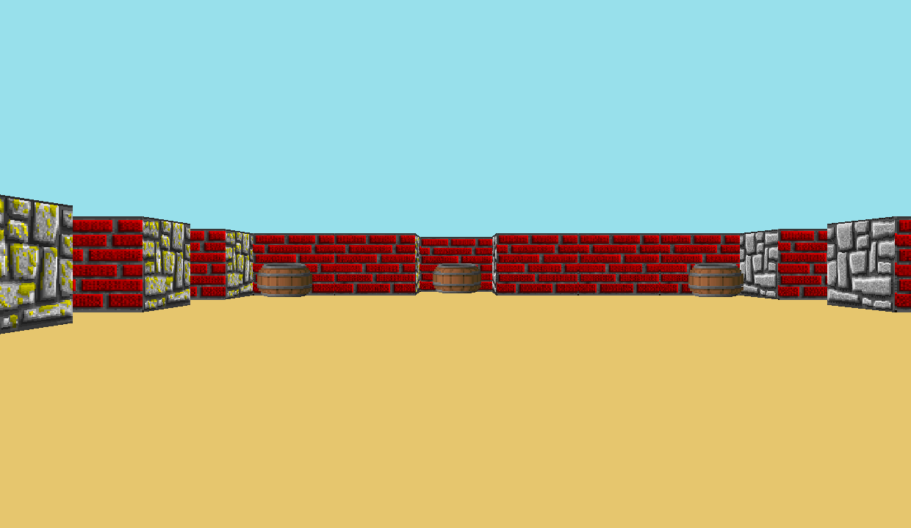

# Моя реализация Raycating
вид от первого лица
(как в [Wolfenstein 3D](https://fr.wikipedia.org/wiki/Wolfenstein_3D)).

### Как запустить
В командной строке использовать команду ``make`` для создания ``cub3D`` исполняемого файла
Карты хроняться в папке maps с расширение .cub
## формат карты
R 1240 720  разрешение 

### Controls

You can move around the maze with ``W`` ``A`` ``S`` ``D``.
You can also rotate the view with the directional arrows ``←`` and ``→``.
You can increase the move speed with ``SHIFT``.
To exit the game, press ``ESC`` or click the red cross.

## Resources

* [Tutorial](https://lodev.org/cgtutor/raycasting.html)
* [Wolfenstein 3D](http://users.atw.hu/wolf3d/)
* [X11](https://github.com/qst0/ft_libgfx)
* [BMP format](https://web.archive.org/web/20080912171714/http://www.fortunecity.com/skyscraper/windows/364/bmpffrmt.html)
* [42 Docs](https://harm-smits.github.io/42docs/)
